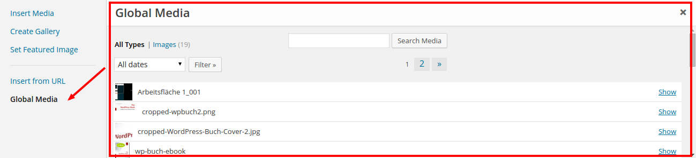

# Multisite Global Media
_Multisite Global Media_ is a WordPress plugin which shares media across the Multisite network.

## Description
This small plugin adds a new tab to the media modal which gives you the opportunity to share media from one site to all the other sites of the network. The `multisite-global-media.php` file uses the ID of the site that will store the global media. Currently the site id is set at `const SITE_ID = 3`. Change this value to set one of the other sites as the default for storing global media.

To get Global Media to work one has to follow these steps:

1. Decide on which blog/site that will host shared media for the network.
2. Add media to the media library for the specific blog/site.
4. Find the ID of a site by going to All Sites section hovering over the site checking the left bottom status bar or installing a plugin that shows the ID's of each site.
3. Open the file multisite-global-media.php go to the following code:

 ```php
 /**
  * Id of side inside the network, there store the global media
  * Select the ID of the site/blog to where you want media that will be shared across the network to be stored.
  *
  * @var    integer
  * @since  2015-01-22
  */
 const SITE_ID = 3;
 ```

### Screenshots
 

## Other Notes

### Crafted by [Inpsyde](http://inpsyde.com) &middot; Engineering the web since 2006.
Yes, we also run that [marketplace for premium WordPress plugins and themes](http://marketpress.com).

### Bugs, technical hints or contribute
Please give me feedback, contribute and file technical bugs on this
[GitHub Repo](https://github.com/bueltge/Multisite-Global-Media/issues), use Issues.

### License
Good news, this plugin is free for everyone! Since it's released under the GPL,
you can use it free of charge on your personal or commercial blog.

### Contact & Feedback
The plugin is designed and developed by team members from the [Inpsyde](http://inpsyde.com/) crew.
Special thanks and praise to Dominik Schilling for his quick help.

Please let me know if you like the plugin or you hate it or whatever ...
Please fork it, add an issue for ideas and bugs.

### Disclaimer
I'm German and my English might be gruesome here and there.
So please be patient with me and let me know of typos or grammatical parts. Thanks
